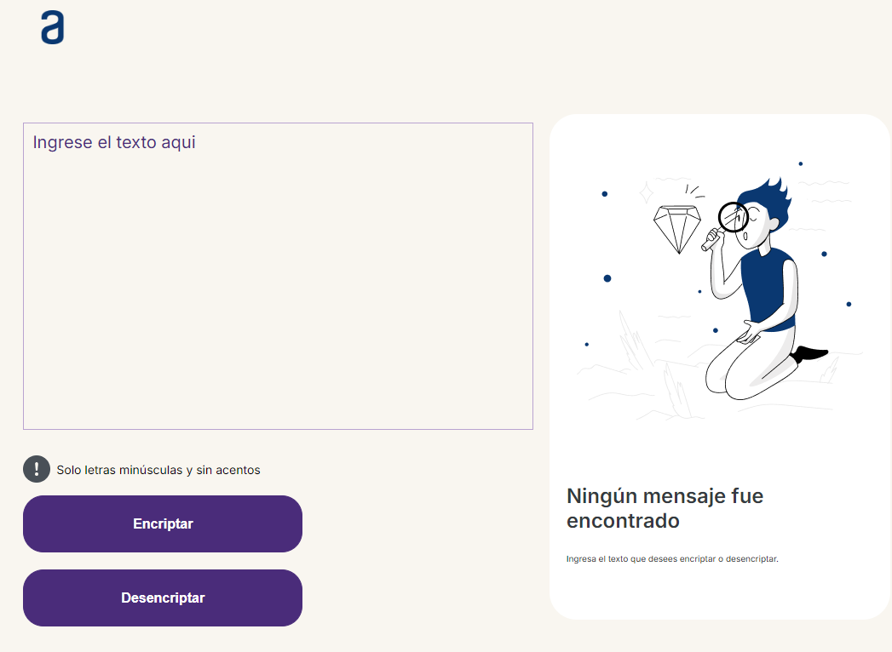

# Proyecto de Encriptación y Desencriptación de Textos
# Alura LATAM

Este proyecto es una aplicación web que permite encriptar y desencriptar mensajes utilizando una serie de reemplazos predefinidos. El proyecto se ha diseñado con HTML, CSS y JavaScript, y es totalmente adaptativo para diferentes dispositivos.



## Tabla de Contenidos

- [Descripción](#descripción)
- [Tecnologías](#tecnologías)
- [Instalación](#instalación)
- [Uso](#uso)
- [Estructura del Proyecto](#estructura-del-proyecto)
- [Contribuciones](#contribuciones)
- [Licencia](#licencia)

## Descripción

La aplicación ofrece una interfaz simple donde los usuarios pueden ingresar un mensaje en un área de texto, encriptarlo usando un botón, y luego desencriptarlo usando otro botón. Además, existe la opción de copiar el texto encriptado o desencriptado al portapapeles del sistema.

## Tecnologías

- **HTML5**: Estructura del contenido.
- **CSS3**: Estilización y diseño adaptativo. Se utilizan variables CSS para los colores y fuentes.
- **JavaScript**: Lógica de encriptación, desencriptación y manejo de eventos.

## Instalación

Para utilizar este proyecto, sigue los siguientes pasos:

1. Clona este repositorio a tu máquina local:

    ```bash
    git clone https://github.com/usuario/proyecto-encriptacion.git
    ```

2. Navega hasta el directorio del proyecto:

    ```bash
    cd proyecto-encriptacion
    ```

3. Abre el archivo `index.html` en tu navegador favorito para ver la aplicación en funcionamiento.

## Uso

1. **Encriptar un Mensaje**:
   - Ingresa el mensaje que deseas encriptar en el área de texto.
   - Haz clic en el botón "Encriptar".
   - El mensaje encriptado aparecerá en la sección de resultados.

2. **Desencriptar un Mensaje**:
   - Ingresa el mensaje encriptado en el área de texto.
   - Haz clic en el botón "Desencriptar".
   - El mensaje desencriptado aparecerá en la sección de resultados.

3. **Copiar el Mensaje**:
   - Una vez que el mensaje ha sido encriptado o desencriptado, haz clic en el botón "Copiar".
   - El mensaje se copiará al portapapeles.

## Estructura del Proyecto

